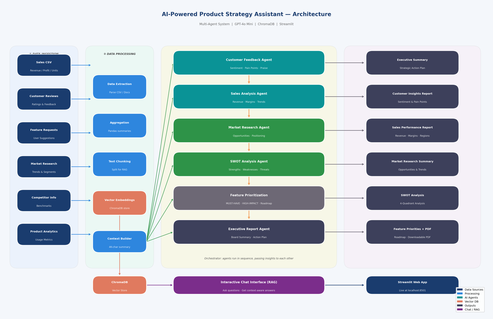

# AI-Powered Product Strategy Assistant

An intelligent multi-agent system that helps Product Managers analyze business data and generate strategic insights, SWOT analysis, feature prioritization, and downloadable executive reports.

---

## Architecture



---

## How It Works

1. **Data Ingestion** — Upload a CSV (or use the bundled sample) containing sales, reviews, and product data
2. **Data Processing** — Pandas aggregates the data into a compact 4K-char context (token-efficient)
3. **Multi-Agent Pipeline** — 6 specialized agents run in sequence, each passing insights to the next
4. **Insight Generation** — Each agent produces a focused report on its domain
5. **Report Creation** — All outputs compiled into a downloadable PDF + interactive chat

---

## Agent Architecture

| Agent | Role | Input |
|---|---|---|
| Customer Feedback Agent | Sentiment analysis, pain points, satisfaction drivers | Sales data + reviews |
| Sales Analysis Agent | Revenue trends, profit margins, regional performance | Sales data |
| Market Research Agent | Opportunities, consumer behavior, market positioning | Data + prior 2 agents |
| SWOT Analysis Agent | Strengths, Weaknesses, Opportunities, Threats | Prior 3 agents |
| Feature Prioritization Agent | MUST-HAVE / HIGH-IMPACT improvements, Q1–Q4 roadmap | Prior 4 agents |
| Executive Report Agent | Board-level summary, strategic action plan | All prior agents |

Agents are orchestrated sequentially — each agent receives the insights from all previous agents, enabling cumulative reasoning.

---

## Tech Stack

| Layer | Technology |
|---|---|
| AI Model | GPT-4o Mini (via custom gateway) |
| Frontend | Streamlit |
| Vector Database | ChromaDB (for RAG-based chat) |
| PDF Generation | ReportLab |
| Data Processing | Pandas |
| HTTP Client | httpx |

---

## Project Structure

```
Assignment 3/
├── app.py                          # Main Streamlit application
├── generate_sample_report.py       # Script to generate sample PDF from CLI
├── generate_architecture_diagram.py# Script to regenerate architecture diagram
├── requirements.txt                # Python dependencies
├── Sample Sales Data.csv           # Bundled sample dataset
├── Sample_Generated_Report.pdf     # Pre-generated sample output
├── Architecture_Diagram.png        # System architecture diagram
│
├── agents/
│   ├── base_agent.py               # Shared OpenAI client wrapper
│   ├── orchestrator.py             # Runs all agents in sequence
│   ├── customer_feedback_agent.py
│   ├── sales_analysis_agent.py
│   ├── market_research_agent.py
│   ├── swot_agent.py
│   ├── feature_prioritization_agent.py
│   └── executive_report_agent.py
│
└── utils/
    ├── data_processor.py           # CSV loading + aggregation + context builder
    ├── vector_store.py             # ChromaDB store + RAG chat
    └── pdf_generator.py            # ReportLab PDF with KPI table + all sections
```

---

## Setup & Run

### 1. Install dependencies

```bash
pip install -r requirements.txt
```

### 2. Run the web app

```bash
streamlit run app.py
```

Open [http://localhost:8501](http://localhost:8501) in your browser.

### 3. Generate a sample report from CLI

```bash
python generate_sample_report.py
```

This runs all 6 agents and saves `Sample_Generated_Report.pdf`.

---

## Sample Dataset

The bundled `Sample Sales Data.csv` contains 4 months of sales records (Jan–Apr 2026) with:

- 10 products across 5 categories (Electronics, Wearables, Accessories, Audio, Smart Home)
- 5 regions (North, South, East, West, Central)
- Fields: Date, Product, Category, Region, Units Sold, Revenue, Cost, Profit, Marketing Spend, Customer Rating, Returns, New Customers, Review

**Key metrics from sample data:**

| Metric | Value |
|---|---|
| Total Revenue | $4,732,790 |
| Total Profit | $1,901,416 |
| Units Sold | 24,239 |
| Avg Customer Rating | 4.39 / 5 |
| New Customers | 9,309 |

---

## Expected Outputs

After running analysis, the app generates:

- **Customer Insights Report** — sentiment breakdown, top complaints and praises
- **Sales Performance Report** — revenue trends, margin analysis, regional rankings
- **Market Research Summary** — opportunities, consumer behavior patterns
- **SWOT Analysis** — 4-quadrant analysis backed by data
- **Feature Prioritization & Roadmap** — ranked improvements with Q1–Q4 timeline
- **Executive Summary** — board-level strategic action plan
- **Downloadable PDF** — all sections compiled with KPI dashboard
- **Interactive Chat** — ask questions about the analysis using natural language (RAG)

---

## Evaluation Criteria Coverage

| Criteria | Coverage |
|---|---|
| Multi-Agent Architecture (min 3) | 6 agents implemented |
| Natural Language Interaction | Chat interface with ChromaDB RAG |
| Customer Feedback Analysis | Dedicated agent with sentiment + pain points |
| Sales & Market Analysis | Dedicated agents with data-backed insights |
| SWOT Analysis | Dedicated synthesis agent |
| Feature Prioritization | MUST-HAVE / HIGH-IMPACT / roadmap agent |
| Executive Report | Board-level summary agent |
| Downloadable PDF | ReportLab PDF with KPI table |
| Vector Database | ChromaDB for RAG-based chat |

---

## Sample Generated Report

A pre-generated sample report is included: [Sample_Generated_Report.pdf](Sample_Generated_Report.pdf)
